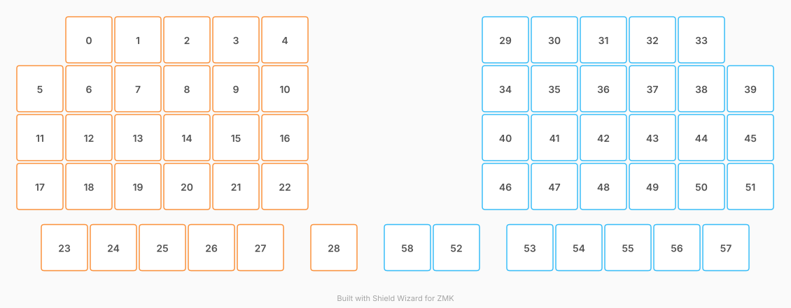

# ZMK Configuration for SpitBall

*Generated by Shield Wizard for ZMK*



Download compiled firmware from the Actions tab. <https://zmk.dev/docs/user-setup#installing-the-firmware>

Edit your keymap <https://zmk.dev/docs/keymaps>.
User keymap is located at [`config/spitball.keymap`](config/spitball.keymap).

-----

<details>
<summary>
Shield Wizard Debug Information
</summary>

In case of broken configuration, here is the Shield Wizard internal data used to generate this configuration:

Commit: ca55a53f6474e718724b81392c8be8f4793cf490

```json
{"name":"SpitBall","shield":"spitball","dongle":false,"modules":["badjeff/pmw3610"],"layout":[{"id":"01M04GJGJGS3J8Q57ADGVZQRTV","part":0,"row":0,"col":1,"w":1,"h":1,"x":1,"y":0,"r":0,"rx":0,"ry":0},{"id":"01M04GJGTMKBWYVJZXBC9PCHY9","part":0,"row":0,"col":2,"w":1,"h":1,"x":2,"y":0,"r":0,"rx":0,"ry":0},{"id":"01M04GJH2XVGTZZ5KZ9488VHWQ","part":0,"row":0,"col":3,"w":1,"h":1,"x":3,"y":0,"r":0,"rx":0,"ry":0},{"id":"01M04GJHB2D0GQ62F449XBD912","part":0,"row":0,"col":4,"w":1,"h":1,"x":4,"y":0,"r":0,"rx":0,"ry":0},{"id":"01M04GJHKZWPRXPV2QCDDW4JZR","part":0,"row":0,"col":5,"w":1,"h":1,"x":5,"y":0,"r":0,"rx":0,"ry":0},{"id":"01M04GJSBQAHJ80RQNZVPMGFCW","part":0,"row":1,"col":0,"w":1,"h":1,"x":0,"y":1,"r":0,"rx":0,"ry":0},{"id":"01M04GJSBQ44NRQVHMC4WT7R5F","part":0,"row":1,"col":1,"w":1,"h":1,"x":1,"y":1,"r":0,"rx":0,"ry":0},{"id":"01M04GJSBQN7FPCVJH4B36GSMA","part":0,"row":1,"col":2,"w":1,"h":1,"x":2,"y":1,"r":0,"rx":0,"ry":0},{"id":"01M04GJSBQ9DTFXXGZDDBDXWKH","part":0,"row":1,"col":3,"w":1,"h":1,"x":3,"y":1,"r":0,"rx":0,"ry":0},{"id":"01M04GJSBQ3XRKWHPM0YC3BBAB","part":0,"row":1,"col":4,"w":1,"h":1,"x":4,"y":1,"r":0,"rx":0,"ry":0},{"id":"01M04GJSBQ2KQD1B11QF17NWFH","part":0,"row":1,"col":5,"w":1,"h":1,"x":5,"y":1,"r":0,"rx":0,"ry":0},{"id":"01M04GJT7VVFP7VE1PA6AVK4ET","part":0,"row":2,"col":0,"w":1,"h":1,"x":0,"y":2,"r":0,"rx":0,"ry":0},{"id":"01M04GJT7VC8GYQG2CV3T33MAB","part":0,"row":2,"col":1,"w":1,"h":1,"x":1,"y":2,"r":0,"rx":0,"ry":0},{"id":"01M04GJT7VMW8N0ST2ZB5CKA1P","part":0,"row":2,"col":2,"w":1,"h":1,"x":2,"y":2,"r":0,"rx":0,"ry":0},{"id":"01M04GJT7V9EZ7A1G32K3C1206","part":0,"row":2,"col":3,"w":1,"h":1,"x":3,"y":2,"r":0,"rx":0,"ry":0},{"id":"01M04GJT7VH3RNHZYFEVZB77YV","part":0,"row":2,"col":4,"w":1,"h":1,"x":4,"y":2,"r":0,"rx":0,"ry":0},{"id":"01M04GJT7VWF8A21R2F8EPTZB5","part":0,"row":2,"col":5,"w":1,"h":1,"x":5,"y":2,"r":0,"rx":0,"ry":0},{"id":"01M04GJV166Y71K386Q3AK4HGV","part":0,"row":3,"col":0,"w":1,"h":1,"x":0,"y":3,"r":0,"rx":0,"ry":0},{"id":"01M04GJV16AF01JMT7HFYE8J4M","part":0,"row":3,"col":1,"w":1,"h":1,"x":1,"y":3,"r":0,"rx":0,"ry":0},{"id":"01M04GJV16SMM5C2B6643CHQXC","part":0,"row":3,"col":2,"w":1,"h":1,"x":2,"y":3,"r":0,"rx":0,"ry":0},{"id":"01M04GJV16AFQXXTDGA2KE0BB3","part":0,"row":3,"col":3,"w":1,"h":1,"x":3,"y":3,"r":0,"rx":0,"ry":0},{"id":"01M04GJV166ZQDNG7GG5989A8B","part":0,"row":3,"col":4,"w":1,"h":1,"x":4,"y":3,"r":0,"rx":0,"ry":0},{"id":"01M04GJV168AYMCVH66QJCAACE","part":0,"row":3,"col":5,"w":1,"h":1,"x":5,"y":3,"r":0,"rx":0,"ry":0},{"id":"01M04GKVZK2DDHGS8NF596T6GT","part":0,"row":4,"col":0,"w":1,"h":1,"x":0.5,"y":4.25,"r":0,"rx":0,"ry":0},{"id":"01M04GKVZKE4DRRNYXVH5KFGRW","part":0,"row":4,"col":1,"w":1,"h":1,"x":1.5,"y":4.25,"r":0,"rx":0,"ry":0},{"id":"01M04GKVZKQM341GHR0HS4X6D9","part":0,"row":4,"col":2,"w":1,"h":1,"x":2.5,"y":4.25,"r":0,"rx":0,"ry":0},{"id":"01M04GKVZKMC0C4ZHSFDVAABQR","part":0,"row":4,"col":3,"w":1,"h":1,"x":3.5,"y":4.25,"r":0,"rx":0,"ry":0},{"id":"01M04GKVZKMQTP1HR9PJ9Z9WJ6","part":0,"row":4,"col":4,"w":1,"h":1,"x":4.5,"y":4.25,"r":0,"rx":0,"ry":0},{"id":"01M04GKVZKJDH62SBNYD1PKJ20","part":0,"row":4,"col":5,"w":1,"h":1,"x":6,"y":4.25,"r":0,"rx":0,"ry":0},{"id":"01M04GMGPBQXZWSMNEXWZQWJYA","part":1,"row":5,"col":0,"w":1,"h":1,"x":9.5,"y":0,"r":0,"rx":0,"ry":0},{"id":"01M04GMGPBQQZ51X2V0ABGTD64","part":1,"row":5,"col":1,"w":1,"h":1,"x":10.5,"y":0,"r":0,"rx":0,"ry":0},{"id":"01M04GMGPB0FWYGEJ2VX3WCEW7","part":1,"row":5,"col":2,"w":1,"h":1,"x":11.5,"y":0,"r":0,"rx":0,"ry":0},{"id":"01M04GMGPBXY44RKM57RHKTRJD","part":1,"row":5,"col":3,"w":1,"h":1,"x":12.5,"y":0,"r":0,"rx":0,"ry":0},{"id":"01M04GMGPB80BBQNHW23SZG6BX","part":1,"row":5,"col":4,"w":1,"h":1,"x":13.5,"y":0,"r":0,"rx":0,"ry":0},{"id":"01M04GMGPBAJ3MW3M86J9PDD3J","part":1,"row":6,"col":0,"w":1,"h":1,"x":9.5,"y":1,"r":0,"rx":0,"ry":0},{"id":"01M04GMGPB9Z2REQSSWCM5JX40","part":1,"row":6,"col":1,"w":1,"h":1,"x":10.5,"y":1,"r":0,"rx":0,"ry":0},{"id":"01M04GMGPB9ZT6WJE6T6PP5N4N","part":1,"row":6,"col":2,"w":1,"h":1,"x":11.5,"y":1,"r":0,"rx":0,"ry":0},{"id":"01M04GMGPBESS0HNQTVPN6GAZT","part":1,"row":6,"col":3,"w":1,"h":1,"x":12.5,"y":1,"r":0,"rx":0,"ry":0},{"id":"01M04GMGPBPW7FCAXQP7WBPG4W","part":1,"row":6,"col":4,"w":1,"h":1,"x":13.5,"y":1,"r":0,"rx":0,"ry":0},{"id":"01M04GMGPB6X459M6F6XYZ90Q4","part":1,"row":6,"col":5,"w":1,"h":1,"x":14.5,"y":1,"r":0,"rx":0,"ry":0},{"id":"01M04GMGPC9242PJE50E6482EW","part":1,"row":7,"col":0,"w":1,"h":1,"x":9.5,"y":2,"r":0,"rx":0,"ry":0},{"id":"01M04GMGPBV41XHQT1D6EW4SBY","part":1,"row":7,"col":1,"w":1,"h":1,"x":10.5,"y":2,"r":0,"rx":0,"ry":0},{"id":"01M04GMGPB711QERJ2SX6EH75Y","part":1,"row":7,"col":2,"w":1,"h":1,"x":11.5,"y":2,"r":0,"rx":0,"ry":0},{"id":"01M04GMGPBCA0YWF2MDHSPCPKY","part":1,"row":7,"col":3,"w":1,"h":1,"x":12.5,"y":2,"r":0,"rx":0,"ry":0},{"id":"01M04GMGPB3SV1NHD5EWB6XSD6","part":1,"row":7,"col":4,"w":1,"h":1,"x":13.5,"y":2,"r":0,"rx":0,"ry":0},{"id":"01M04GMGPB9J7JABFFC15WKZKX","part":1,"row":7,"col":5,"w":1,"h":1,"x":14.5,"y":2,"r":0,"rx":0,"ry":0},{"id":"01M04GMGPCHTM0HTQC97SMG6G5","part":1,"row":8,"col":0,"w":1,"h":1,"x":9.5,"y":3,"r":0,"rx":0,"ry":0},{"id":"01M04GMGPCSQ3VP5V3V3GV0CY4","part":1,"row":8,"col":1,"w":1,"h":1,"x":10.5,"y":3,"r":0,"rx":0,"ry":0},{"id":"01M04GMGPCX8BWG8KC93ADBAG7","part":1,"row":8,"col":2,"w":1,"h":1,"x":11.5,"y":3,"r":0,"rx":0,"ry":0},{"id":"01M04GMGPCB2Z1GTTDT7PYAM7D","part":1,"row":8,"col":3,"w":1,"h":1,"x":12.5,"y":3,"r":0,"rx":0,"ry":0},{"id":"01M04GMGPCCZARDPCCJ7TBHGDV","part":1,"row":8,"col":4,"w":1,"h":1,"x":13.5,"y":3,"r":0,"rx":0,"ry":0},{"id":"01M04GMGPCW64AXTR7R8GDJW1F","part":1,"row":8,"col":5,"w":1,"h":1,"x":14.5,"y":3,"r":0,"rx":0,"ry":0},{"id":"01M04GMGPCHDHCFJVWSYEAF426","part":1,"row":9,"col":0,"w":1,"h":1,"x":8.5,"y":4.25,"r":0,"rx":0,"ry":0},{"id":"01M04GMGPCMZ4MGYW2BKE88EZG","part":1,"row":9,"col":1,"w":1,"h":1,"x":10,"y":4.25,"r":0,"rx":0,"ry":0},{"id":"01M04GMGPCDSP8Y68W6D070A5N","part":1,"row":9,"col":2,"w":1,"h":1,"x":11,"y":4.25,"r":0,"rx":0,"ry":0},{"id":"01M04GMGPCPQYGMX3YHDZ5MQXR","part":1,"row":9,"col":3,"w":1,"h":1,"x":12,"y":4.25,"r":0,"rx":0,"ry":0},{"id":"01M04GMGPC7RS7XB9CHXRC3E2B","part":1,"row":9,"col":4,"w":1,"h":1,"x":13,"y":4.25,"r":0,"rx":0,"ry":0},{"id":"01M04GMGPC1JM3J3R2BD7SGD3W","part":1,"row":9,"col":5,"w":1,"h":1,"x":14,"y":4.25,"r":0,"rx":0,"ry":0},{"id":"01M04GXDY54VT1VWZQNAK1XPP6","part":1,"row":10,"col":0,"w":1,"h":1,"x":7.5,"y":4.25,"r":0,"rx":0,"ry":0}],"parts":[{"name":"left","controller":"nice_nano_v2","pins":{"d2":{"usage":"kscan","kscan":"01M04GQWQT7HA4D20HQT66AVF2","role":"input"},"d3":{"usage":"kscan","kscan":"01M04GQWQT7HA4D20HQT66AVF2","role":"input"},"d8":{"usage":"kscan","kscan":"01M04GQWQT7HA4D20HQT66AVF2","role":"input"},"d9":{"usage":"kscan","kscan":"01M04GQWQT7HA4D20HQT66AVF2","role":"input"},"d21":{"usage":"kscan","kscan":"01M04GQWQT7HA4D20HQT66AVF2","role":"input"},"d16":{"usage":"kscan","kscan":"01M04GQWQT7HA4D20HQT66AVF2","role":"output"},"d14":{"usage":"kscan","kscan":"01M04GQWQT7HA4D20HQT66AVF2","role":"output"},"d15":{"usage":"kscan","kscan":"01M04GQWQT7HA4D20HQT66AVF2","role":"output"},"d18":{"usage":"kscan","kscan":"01M04GQWQT7HA4D20HQT66AVF2","role":"output"},"d19":{"usage":"kscan","kscan":"01M04GQWQT7HA4D20HQT66AVF2","role":"output"},"d20":{"usage":"kscan","kscan":"01M04GQWQT7HA4D20HQT66AVF2","role":"output"}},"kscans":[{"kind":"matrix","id":"01M04GQWQT7HA4D20HQT66AVF2","diodes":true}],"keys":{"01M04GJGJGS3J8Q57ADGVZQRTV":{"input":"d2","output":"d19"},"01M04GJGTMKBWYVJZXBC9PCHY9":{"input":"d2","output":"d18"},"01M04GJH2XVGTZZ5KZ9488VHWQ":{"input":"d2","output":"d15"},"01M04GJHB2D0GQ62F449XBD912":{"input":"d2","output":"d14"},"01M04GJHKZWPRXPV2QCDDW4JZR":{"input":"d2","output":"d16"},"01M04GJSBQAHJ80RQNZVPMGFCW":{"input":"d3","output":"d20"},"01M04GJSBQ44NRQVHMC4WT7R5F":{"input":"d3","output":"d19"},"01M04GJSBQN7FPCVJH4B36GSMA":{"input":"d3","output":"d18"},"01M04GJSBQ9DTFXXGZDDBDXWKH":{"input":"d3","output":"d15"},"01M04GJSBQ3XRKWHPM0YC3BBAB":{"input":"d3","output":"d14"},"01M04GJSBQ2KQD1B11QF17NWFH":{"input":"d3","output":"d16"},"01M04GJT7VVFP7VE1PA6AVK4ET":{"input":"d8","output":"d20"},"01M04GJT7VC8GYQG2CV3T33MAB":{"input":"d8","output":"d19"},"01M04GJT7VMW8N0ST2ZB5CKA1P":{"input":"d8","output":"d18"},"01M04GJT7V9EZ7A1G32K3C1206":{"input":"d8","output":"d15"},"01M04GJT7VH3RNHZYFEVZB77YV":{"input":"d8","output":"d14"},"01M04GJT7VWF8A21R2F8EPTZB5":{"input":"d8","output":"d16"},"01M04GJV166Y71K386Q3AK4HGV":{"input":"d9","output":"d20"},"01M04GJV16AF01JMT7HFYE8J4M":{"input":"d9","output":"d19"},"01M04GJV16SMM5C2B6643CHQXC":{"input":"d9","output":"d18"},"01M04GJV16AFQXXTDGA2KE0BB3":{"input":"d9","output":"d15"},"01M04GJV166ZQDNG7GG5989A8B":{"input":"d9","output":"d14"},"01M04GJV168AYMCVH66QJCAACE":{"input":"d9","output":"d16"},"01M04GKVZK2DDHGS8NF596T6GT":{"input":"d21","output":"d20"},"01M04GKVZKE4DRRNYXVH5KFGRW":{"input":"d21","output":"d19"},"01M04GKVZKQM341GHR0HS4X6D9":{"input":"d21","output":"d18"},"01M04GKVZKMC0C4ZHSFDVAABQR":{"input":"d21","output":"d15"},"01M04GKVZKMQTP1HR9PJ9Z9WJ6":{"input":"d21","output":"d14"},"01M04GKVZKJDH62SBNYD1PKJ20":{"input":"d21","output":"d16"}},"encoders":[],"buses":{}},{"name":"right","controller":"nice_nano_v2","pins":{"d2":{"usage":"kscan","kscan":"01M04GWQ43D1KVM3471DHTSWBE","role":"input"},"d3":{"usage":"kscan","kscan":"01M04GWQ43D1KVM3471DHTSWBE","role":"input"},"d8":{"usage":"kscan","kscan":"01M04GWQ43D1KVM3471DHTSWBE","role":"input"},"d9":{"usage":"kscan","kscan":"01M04GWQ43D1KVM3471DHTSWBE","role":"input"},"d21":{"usage":"kscan","kscan":"01M04GWQ43D1KVM3471DHTSWBE","role":"input"},"d20":{"usage":"kscan","kscan":"01M04GWQ43D1KVM3471DHTSWBE","role":"output"},"d19":{"usage":"kscan","kscan":"01M04GWQ43D1KVM3471DHTSWBE","role":"output"},"d18":{"usage":"kscan","kscan":"01M04GWQ43D1KVM3471DHTSWBE","role":"output"},"d15":{"usage":"kscan","kscan":"01M04GWQ43D1KVM3471DHTSWBE","role":"output"},"d14":{"usage":"kscan","kscan":"01M04GWQ43D1KVM3471DHTSWBE","role":"output"},"d0":{"usage":"kscan","kscan":"01M04H5AYPPGGJ9C8FB2S34B20","role":"input"},"d4":{"usage":"bus","bus":"spi0","role":"sck"},"d5":{"usage":"bus","bus":"spi0","role":"miosio"},"d6":{"usage":"device","deviceId":"01M04H6FNY8A2APZ8N5Y7DHFC5","role":"cs"},"d7":{"usage":"device","deviceId":"01M04H6FNY8A2APZ8N5Y7DHFC5","role":"irq"},"d16":{"usage":"kscan","kscan":"01M04GWQ43D1KVM3471DHTSWBE","role":"output"}},"kscans":[{"kind":"matrix","id":"01M04GWQ43D1KVM3471DHTSWBE","diodes":true},{"kind":"direct","id":"01M04H5AYPPGGJ9C8FB2S34B20","mode":"gnd"}],"keys":{"01M04GMGPBQXZWSMNEXWZQWJYA":{"input":"d2","output":"d20"},"01M04GMGPBQQZ51X2V0ABGTD64":{"input":"d2","output":"d19"},"01M04GMGPB0FWYGEJ2VX3WCEW7":{"input":"d2","output":"d18"},"01M04GMGPBXY44RKM57RHKTRJD":{"input":"d2","output":"d15"},"01M04GMGPB80BBQNHW23SZG6BX":{"input":"d2","output":"d14"},"01M04GMGPBAJ3MW3M86J9PDD3J":{"input":"d3","output":"d20"},"01M04GMGPB9Z2REQSSWCM5JX40":{"input":"d3","output":"d19"},"01M04GMGPB9ZT6WJE6T6PP5N4N":{"input":"d3","output":"d18"},"01M04GMGPBESS0HNQTVPN6GAZT":{"input":"d3","output":"d15"},"01M04GMGPBPW7FCAXQP7WBPG4W":{"input":"d3","output":"d14"},"01M04GMGPB6X459M6F6XYZ90Q4":{"input":"d3","output":"d16"},"01M04GMGPC9242PJE50E6482EW":{"input":"d8","output":"d20"},"01M04GMGPBV41XHQT1D6EW4SBY":{"input":"d8","output":"d19"},"01M04GMGPB711QERJ2SX6EH75Y":{"input":"d8","output":"d18"},"01M04GMGPBCA0YWF2MDHSPCPKY":{"input":"d8","output":"d15"},"01M04GMGPB3SV1NHD5EWB6XSD6":{"input":"d8","output":"d14"},"01M04GMGPB9J7JABFFC15WKZKX":{"input":"d8","output":"d16"},"01M04GMGPCHTM0HTQC97SMG6G5":{"input":"d9","output":"d20"},"01M04GMGPCSQ3VP5V3V3GV0CY4":{"input":"d9","output":"d19"},"01M04GMGPCX8BWG8KC93ADBAG7":{"input":"d9","output":"d18"},"01M04GMGPCB2Z1GTTDT7PYAM7D":{"input":"d9","output":"d15"},"01M04GMGPCCZARDPCCJ7TBHGDV":{"input":"d9","output":"d14"},"01M04GMGPCW64AXTR7R8GDJW1F":{"input":"d9","output":"d16"},"01M04GXDY54VT1VWZQNAK1XPP6":{"input":"d0"},"01M04GMGPCHDHCFJVWSYEAF426":{"input":"d21","output":"d20"},"01M04GMGPCMZ4MGYW2BKE88EZG":{"input":"d21","output":"d19"},"01M04GMGPCDSP8Y68W6D070A5N":{"input":"d21","output":"d18"},"01M04GMGPCPQYGMX3YHDZ5MQXR":{"input":"d21","output":"d15"},"01M04GMGPC7RS7XB9CHXRC3E2B":{"input":"d21","output":"d14"},"01M04GMGPC1JM3J3R2BD7SGD3W":{"input":"d21","output":"d16"}},"encoders":[],"buses":{"spi0":{"type":"spi","devices":[{"id":"01M04H6FNY8A2APZ8N5Y7DHFC5","type":"pmw3610","cpi":800,"swapxy":true,"invertx":true,"inverty":true}]}}}]}
```

</details>
